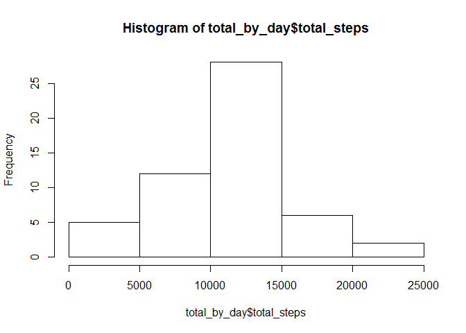
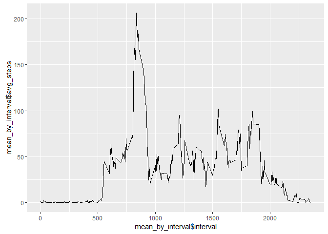
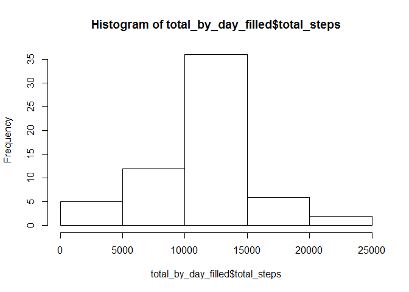
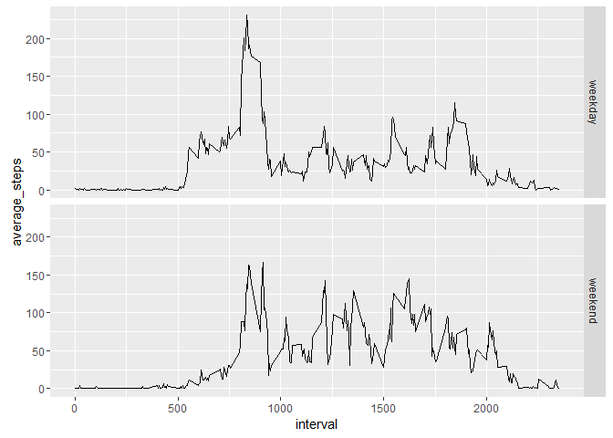

# Reproducible Research: Peer Assessment 1

```r
library(dplyr)
```

```
## 
## Attaching package: 'dplyr'
```

```
## The following objects are masked from 'package:stats':
## 
##     filter, lag
```

```
## The following objects are masked from 'package:base':
## 
##     intersect, setdiff, setequal, union
```

```r
library(ggplot2)
```

### Loading and preprocessing the data

The personal activity monitoring device data was obtained from https://d396qusza40orc.cloudfront.net/repdata%2Fdata%2Factivity.zip on 2/17/2016.  This file extracts into `activity.csv`. `activity.csv` is a comma-seperated-value (csv) file containing 17,568 observations of the following variables:

* steps: Number of steps taking in a 5-minute interval (missing values are coded as NA)
* date: The date on which the measurement was taken in YYYY-MM-DD format
* interval: Identifier for the 5-minute interval in which measurement was taken

The data is read into a table, the date column is converted to a Date, and the table is converted to a table frame

```r
activity<-read.csv("activity.csv")
activity$date<-as.Date(as.character(activity$date),format = "%Y-%m-%d")
activity<-tbl_df(activity)
```

### What is mean total number of steps taken per day?

First we group the data by day and then summarize by totaling over each day.  The results are then plotted in a histogram to show the distribution of total steps by day.

```r
by_day <- activity %>% group_by(date)
total_by_day<-by_day %>% summarise(total_steps = sum(steps))
hist(total_by_day$total_steps)
```



The mean total number of steps taken per day is:

```r
mean(total_by_day$total_steps,na.rm = TRUE)
```

```
## [1] 10766.19
```

The median total number of steps taken per day is:

```r
median(total_by_day$total_steps,na.rm = TRUE)
```

```
## [1] 10765
```

### What is the average daily activity pattern?

We generate a time series plot of the 5-minute interval and the average number of steps taken across all days:

```r
mean_by_interval<-activity %>% group_by(interval) %>% summarise(avg_steps=mean(steps,na.rm = TRUE))
str(mean_by_interval)
```

```
## Classes 'tbl_df', 'tbl' and 'data.frame':	288 obs. of  2 variables:
##  $ interval : int  0 5 10 15 20 25 30 35 40 45 ...
##  $ avg_steps: num  1.717 0.3396 0.1321 0.1509 0.0755 ...
```

```r
qplot(x=mean_by_interval$interval,y=mean_by_interval$avg_steps,geom = "line")
```



From the plot we can see there is a clear maximum.  The following 5-minute interval contains the maximum number of steps on average across all the days in the dataset:

```r
mean_by_interval$interval[which.max(mean_by_interval$avg_steps)]
```

```
## [1] 835
```

### Imputing missing values

The dataset contains the following number of rows with missing values:

```r
nrow(activity)-sum(complete.cases(activity))
```

```
## [1] 2304
```

In order to avoid bias in later calculations, we use the average for each 5-minute interval to fill in those missing values and store that in a new dataset.

```r
activity_filled<-activity
activity_filled$steps[is.na(activity_filled$steps)]<-mean_by_interval$avg_steps[match(activity_filled$interval[is.na(activity_filled$steps)],mean_by_interval$interval)]
```

Then we repeat the analysis from above by creating the histogram of the total number of steps taken each day.

```r
by_day_filled <- activity_filled %>% group_by(date)
total_by_day_filled<-by_day_filled %>% summarize(total_steps = sum(steps))
hist(total_by_day_filled$total_steps)
```



We also note that the mean has not changed, but the median now contains the mean because we wrote that over the misssing values.  Since later on we are using averages to look at activity patterns, these calculated values should have little effect on the final results.

Mean with interval average values in place of missing values:

```r
mean(total_by_day_filled$total_steps,na.rm = TRUE)
```

```
## [1] 10766.19
```

Median with interval average values in place of missing values:

```r
median(total_by_day_filled$total_steps,na.rm = TRUE)
```

```
## [1] 10766.19
```

### Are there differences in activity patterns between weekdays and weekends?

Using the `weekdays()` function, we create a new variable containing the weekday which is replaced with "weekday" or "weekend" using `grep`.  This in turn is turned into a factor to use in plotting next.

```r
activity_filled<-mutate(activity_filled,day_type=weekdays(date))
activity_filled$day_type[grep("^S",activity_filled$day_type)]<-"weekend"
activity_filled$day_type[grep("^[MTWF]",activity_filled$day_type)]<-"weekday"
activity_filled$day_type<-factor(activity_filled$day_type)
```

After grouping by interval and day type, we can summarize the steps by averaging.  The resulting average weekday and weekend activity pattern is then plotted in the following figure.

```r
avg_by_day_type<-activity_filled %>% group_by(interval,day_type) %>% summarize(average_steps = mean(steps))
qplot(data=avg_by_day_type, x=interval,y=average_steps,facets =day_type~.,geom="line")
```


